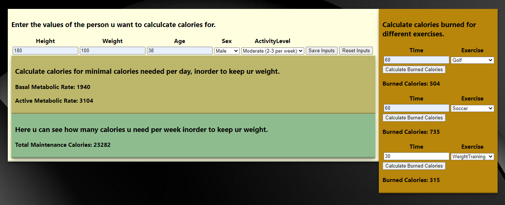

# 1DV610-Laboration2

# calories-counter

A application that can calculate the Basal Metabolic Rate (BMR) and the Active Metabolic Rate (AMR) needed depending on a persons lenght, height, age, sex and activity level. It also have methods for calculate calories burned during different exercises, the result is depending of how long the time it takes to complete the exercise and the weight of the person doing the exercise.

# Install
```bash
git clone https://github.com/dc222bz/1DV610-Laboration2.git
```
```bash
npm install
```

# Run Commands
## Locally

```bash
npm run dev
```
```
  VITE v3.1.8  ready in 648 ms

  ➜  Local:   http://127.0.0.1:5173/
  ➜  Network: use --host to expose
```
## Netlify

[https://calories-counter.netlify.app/](https://calories-counter.netlify.app/)


# Test Documentation

Test documentation for the application testing the interface and error handling:
[Test Documentation](https://github.com/dc222bz/1DV610-Laboration2/blob/main/testrapport.md)

# Requirements Specification

Requirements specification for the application: [Requirements Specification](https://github.com/dc222bz/1DV610-Laboration2/blob/main/kravspecifikation.md)

# Contributing

-[Daniel Carlsson](https://github.com/dc222bz)

# License
MIT

