# Reflection
Daniel Carlsson - <dc222bz@student.lnu.se>

Repo för Applikationen - [https://github.com/dc222bz/1DV610-Laboration2](https://github.com/dc222bz/1DV610-Laboration2)

Produktionsatt Applikation - [https://calories-counter.netlify.app/](https://calories-counter.netlify.app/)

Repo för Modulen - [https://github.com/dc222bz/calories-counter](https://github.com/dc222bz/calories-counter)

NPM sidan - [https://www.npmjs.com/package/@dc222bz/calories-counter](https://www.npmjs.com/package/@dc222bz/calories-counter)

## Kapitel 2 - Meaningful Names

Här fick boken en att tänka till att en sådan enkel sak som ett namn på en variabel kan ge väldig stor påverkan hur en kan tolka din kod. 

Att undvika förkortningar och vara tydlig i vad variablen gör, ska påverka namngivningen. 

Här hade jag tidigare deklarerat getBasalMetabolicRate() som getBMR(). 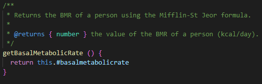

Dessutom att klasser ska namges som substantiv och metoder som verb, vilket gör det lättare att läsa koden som de vore en berättelse.

Klassnamn:

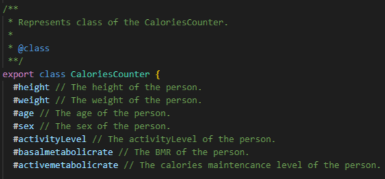

Metodnamn:

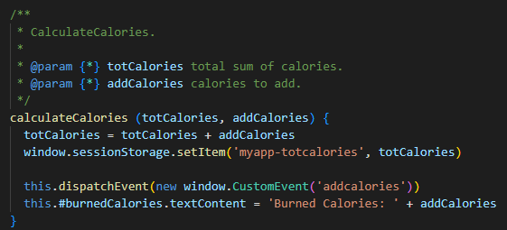

## Kapitel 3 - Functions

Målet med funktioner är att de skall endast utföra en instruktion var.

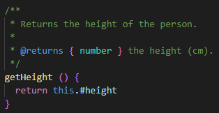

Detta för att öka läsbarheten och gör det lättare att välja ett beskrivande namn till funktionen. 

Dessutom ska funktioner helst undvika att ha argument, vilket också minskar läsbarheten. 

Men i vissa fall kan det vara svårt att hålla nere argumenten när man ska instansiera en ny class, där det lätt blir 2 till 6 argument. 

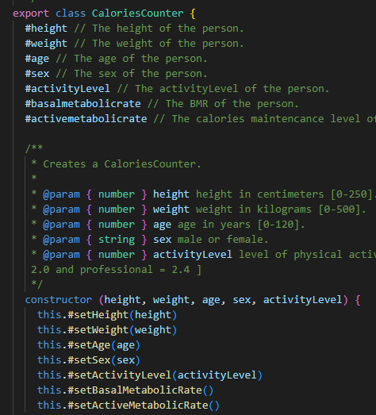

## Kapitel 4 -Comments

Här var boken tydlig att kommentarer gör mer ont än gott, när det kommer till läsbarheten. 

Själv tycker jag att dem har sin plats speciellt med JAVADOC kommenterar som ger en övergrpande bild hur en funktion fungerar.

Detta har man blivit bekväm med från föregånde kurser och kan hålla med boken att försöka hålla sig till att kommentera publika funktioner och klasser som är till för användare. 

## Kapitel 5 - Formating

Formatering är viktig för att ha förhållningsregler att kunna förhålla sig till så att andra lättare ska kunna läsa din kod. 

Att man till exempel håller nera kodlängden i filerna så att den ska vara mer läsbar och läsare inte ska få en vägg med text i ansiktet. 

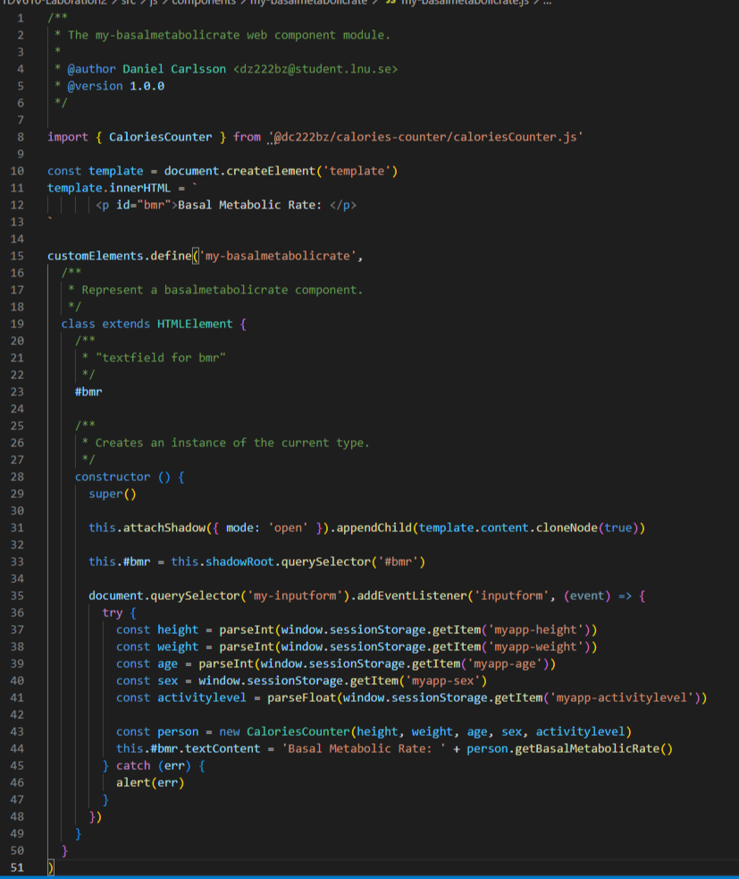

Att man använder sig av tomrader för att lufta koden och göra det lättare för läsare att följa kodutvecklingen.

## Kapitel 6 - Object and Data Structures

Att sätta sina setters till privata är en grundsten i att öka abstarktionen för sin kod. 

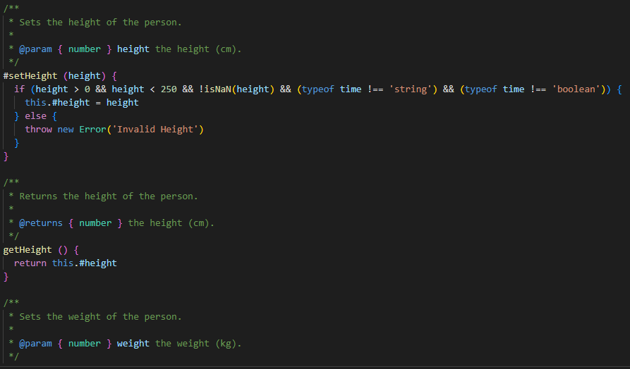

Dessutom att jag i mitt fall använder mig av privata fält för att öka abstarktionen i mina componenter.

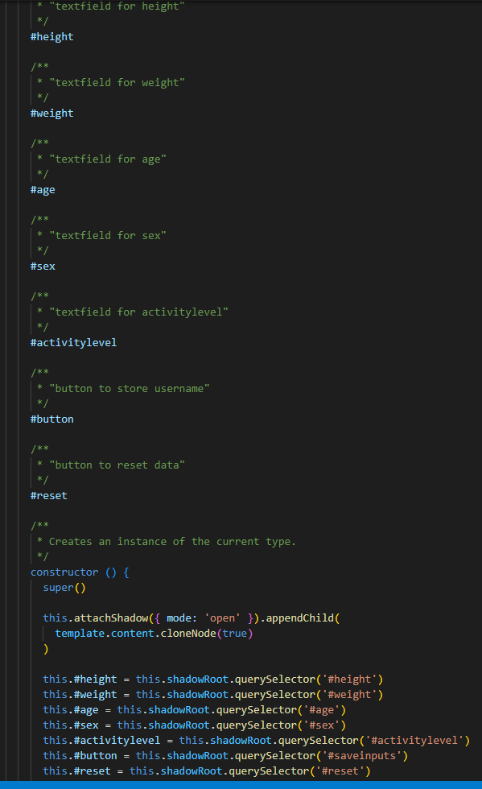

## Kapitel 7 - Error handling

Att använda sig av kasta undantag, ger en tydlig felhantering. 

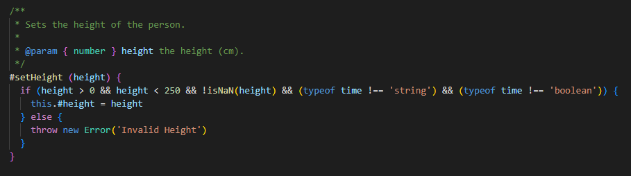

Där man med hjälp av try-catch block enkelt och snyggt kan ta hand om felmeddelande och presentera detta till användaren.

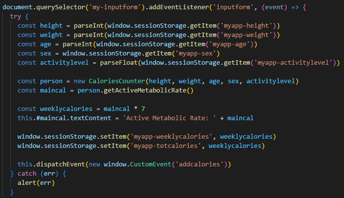

## Kapitel 8 - Boundaries

Att använda sig av kodbas från externa källor har sina risker, att man kan få kod som man ej kan underhålla eller uppdatera och kan utveckla sig till en säkerhetsrisk. 

Man ska verkligen fundera om fördelarna överväger nackdelarna när man väljer att implementera extern kodbas. 

Vi har fått till oss att särkilt på NPM kolla antalet nedladdningar i vecka och utvärdera dem utefter hur många som använder dem och om dem får kontinuerliga uppdateringar.

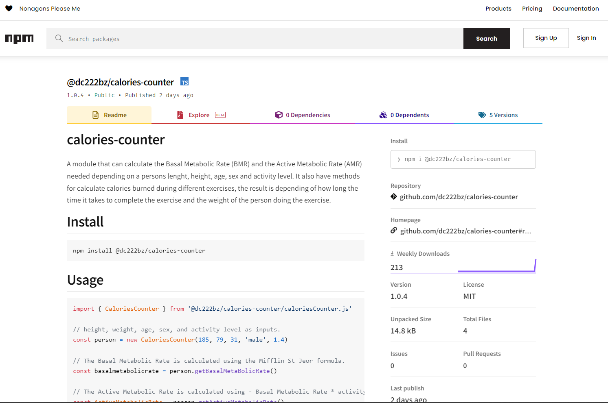

## Kapitel 9 - Unit Tests

Att skriva automatiska enhetstester innan man börjar utveckla sin kod är alltid målet men inte alltid det är så lätt att följa. 

Har man en färdig kravspefification kan man använda denna som mall och skriva ett test för varje krav. 

Men ska man testa ett interface är manuella tester att fördra för enkelthetens skull.

## Kapitel 10 - Classes

Här är målet att skriva små enkla classer som inriktar sig på en uppgift. 

Att jag använder mig av egna custom components som endast inriktar sig på en sak är ett sätt följa denna riklinje. 

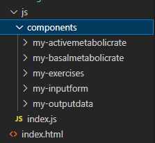

## Kapitel 11 - Systems

Att ha en bra övergripande struktur för applikationen är viktigt, speciellt om man ska skala upp och fler användare kommer in i flödet. 

Håller helt och hållet med kapitlets sista mening, "Whether you are designing systems or individuals modules, nerver forget to use the simplest thing that can possibly work". 

Har själv insett att det är lätt att sväva iväg med att lösa problem och glömma hur den koden man skriver, interegerar med övrig kod. 

Eller hur den skulle bete sig om man skulle skala upp applikationen och lägga in fler olika funktioner. 

En viktig sak att tänka på är om man använder sig av databaser, hur dessa påverkar applikationen vid uppskalning.

Här kommer custom components till sin rätta att man kan kapsla in beroenden, att skapa en component som endast skriver till och läser från databas som sedan andra componenter kan interegera med.

